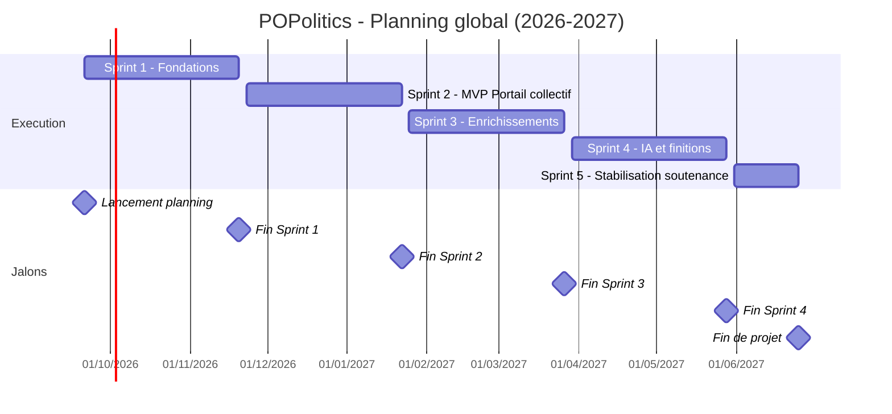
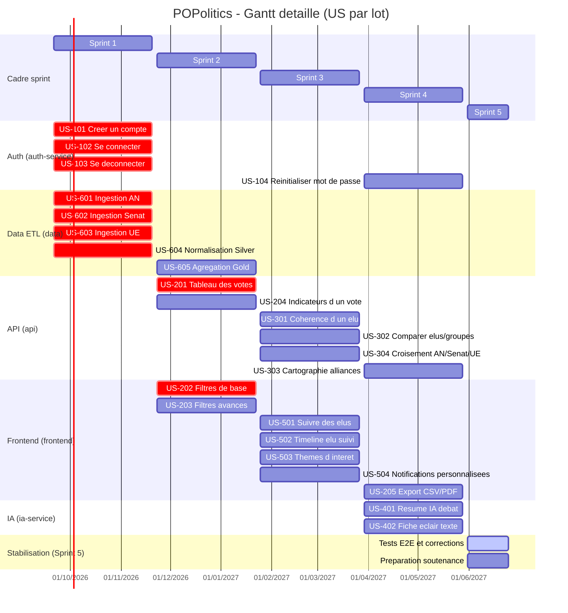

# POPolitics - Diagramme de Gantt

Ce fichier centralise le planning projet sous forme de diagrammes de Gantt :

- une vue macro (sprints + jalons),
- une vue detaillee avec toutes les US planifiees par lot.

## 1) Vue macro

## 2) Vue detaillee (toutes les US)

